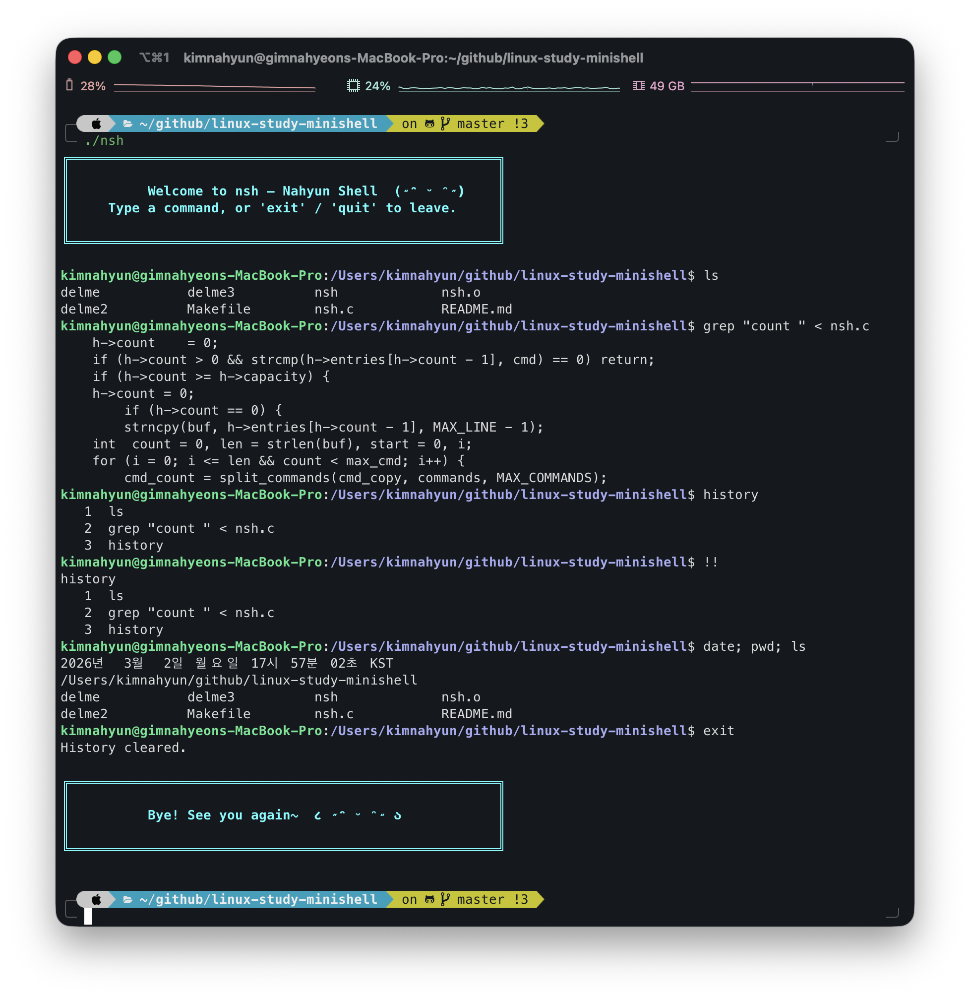

# nsh — Nahyun Shell

> A minimal Unix shell in C with multi-stage pipes, I/O redirection, history navigation, colored prompt, and signal handling.

---

## Demo



---

## Build

```bash
make
./nsh
```

Clean build artifacts:

```bash
make clean
```

---

## Verification

아래 명령어를 순서대로 실행해서 각 기능을 검증한다.  
`nsh.c`가 같은 디렉토리에 있어야 한다.

### Step 1 — 기본 명령 / 백그라운드 실행
```
grep int nsh.c
grep "if.*NULL" nsh.c &
ps
```

### Step 2 — I/O 리다이렉션
```
grep "int " < nsh.c
ls -l
ls -l > delme
cat delme
sort < delme > delme2
cat delme2
date >> delme2
cat delme2
ls /nonexistent 2> err.log
cat err.log
```

### Step 3 — 파이프
```
ps -A | grep -i system
ps -A | grep -i system | awk '{print $1,$4}'
cat nsh.c | head -6 | tail -5 | head -1
```

### Step 4 — 파이프 + 리다이렉션 조합
```
sort < nsh.c | grep "int " | awk '{print $1,$2}' > delme3
cat delme3
```

### Step 5 — cd / pwd / 세미콜론 다중 명령
```
pwd
cd /tmp
pwd
cd
pwd
date; pwd; ls
```

### Step 6 — history
```
history
history -c
history
ls -l
grep int nsh.c
history
!!
!2
```

### Step 7 — 방향키 history 탐색
```
# ↑ 키로 이전 명령어 탐색
# ↓ 키로 최신 명령어로 이동
# ← → 키로 커서 이동 후 중간 편집
```

### Step 8 — Signal / 좀비 프로세스
```
sleep 10 &
sleep 10 &
ps
# Ctrl+C 눌러도 셸이 살아있는지 확인
# 다음 명령 입력 시 [done] pid 메시지 확인
ls
```

---

## Features

### Basic Command Execution
자식 프로세스를 생성하여 명령어를 실행한다. 포그라운드 실행 시 자식이 종료될 때까지 대기한다.

### Background Execution (`&`)
명령어 끝에 `&`를 붙이면 부모 프로세스가 기다리지 않고 다음 명령을 즉시 받는다.  
완료된 백그라운드 프로세스는 다음 프롬프트 출력 전에 자동으로 수거된다.

### I/O Redirection
| 연산자 | 동작 |
|--------|------|
| `<`    | stdin을 파일에서 읽기 |
| `>`    | stdout을 파일로 저장 (덮어쓰기) |
| `>>`   | stdout을 파일에 이어쓰기 |
| `2>`   | stderr를 파일로 저장 |

### Multi-stage Pipes (`|`)
파이프를 재귀적으로 처리하므로 단계 수 제한이 없다.

```
ps -A | grep -i system | awk '{print $1,$4}'
cat nsh.c | head -6 | tail -5 | head -1
```

### Semicolon-separated Commands (`;`)
`;`로 구분된 명령어들을 순서대로 실행한다. 따옴표 내부의 `;`는 구분자로 취급하지 않는다.

```
date; pwd; ls
```

### Built-in Commands
| 명령 | 동작 |
|------|------|
| `cd [dir]` | 디렉토리 이동. 인자 없으면 `$HOME`으로 이동 |
| `pwd` | 현재 작업 디렉토리 출력 |
| `history` | 이전 명령어 목록 출력 |
| `history -c` | 히스토리 전체 삭제 |
| `exit` / `quit` | 셸 종료 |

### History & Arrow Key Navigation
| 입력 | 동작 |
|------|------|
| `↑` / `↓` | 이전/다음 명령어 탐색 |
| `←` / `→` | 커서 이동 (중간 편집 가능) |
| `history` | 전체 히스토리 출력 |
| `!!` | 직전 명령어 재실행 |
| `!n` | n번째 명령어 재실행 |
| `history -c` | 히스토리 초기화 |

### Quote Handling
싱글쿼트/더블쿼트 내부의 공백·특수문자를 하나의 토큰으로 처리한다. 중첩 따옴표도 지원한다.

```
grep "int " < nsh.c
awk '{print $1,$2}'
echo "it's fine"
echo 'say "hello"'
```

### Colored Prompt
termios raw mode 기반으로 `user@hostname:path$` 형태의 컬러 프롬프트를 출력한다.  
`cd` 실행 후 경로가 자동으로 업데이트된다.

### Signal Handling
| 키 | 동작 |
|----|------|
| `Ctrl+C` | 현재 라인 클리어 (셸 유지) / 포그라운드 자식만 종료 |
| `Ctrl+D` | 빈 라인에서 셸 종료 |

---

## Implementation

### Function Overview

| 함수 | 역할 |
|------|------|
| `hist_init/add/print/clear/free()` | History 구조체 생명주기 관리 |
| `read_line()` | termios raw mode 라인 에디터. 방향키·Backspace·Ctrl 처리 |
| `read_input()` | `read_line()` 래퍼. `!!` / `!n` 히스토리 확장 |
| `split_commands()` | `;` 기준 명령어 분리 (따옴표 내부 무시) |
| `parse_args()` | 단일 명령어 → args[] 파싱. 따옴표·`&` 처리 |
| `has_pipe()` | args에 `\|` 토큰 존재 여부 확인 |
| `remove_redir_tokens()` | 리다이렉션 심볼+파일명을 shift로 제거 |
| `apply_redirection()` | `<` `>` `>>` `2>` 처리 후 `dup2()` |
| `execute_single()` | 리다이렉션 적용 후 `execvp()` |
| `execute_pipe_recursive()` | 재귀적 다단계 파이프 실행 |
| `handle_builtin()` | `cd` / `pwd` / `history`를 부모에서 직접 처리 |
| `execute()` | fork 후 builtin/single/pipe 분기, 백그라운드 처리 |

### Raw Mode Line Editor

```
read_line()
  tcsetattr(raw mode)
    ↑ (ESC[A) → hist_pos--, 현재 입력 saved에 저장
    ↓ (ESC[B) → hist_pos++, 끝까지 가면 saved 복원
    ← (ESC[D) → cursor--
    → (ESC[C) → cursor++
    Backspace → buf[cursor-1] 삭제, tail 재출력
    Ctrl+C    → 현재 라인 클리어, 새 프롬프트
    Ctrl+D    → exit
    Enter     → 루프 탈출
  tcsetattr(restore)
```

### Multi-pipe Recursive Strategy

```
execute_pipe_recursive([a | b | c])
  ├─ fork → 손자1: execvp(a)      [stdout → pipe1]
  └─ stdin ← pipe1
     execute_pipe_recursive([b | c])
       ├─ fork → 손자2: execvp(b) [stdout → pipe2]
       └─ stdin ← pipe2
          execute_single([c])     ← base case
```

### Signal Flow

```
main()
  signal(SIGINT, SIG_IGN)      ← 셸은 Ctrl+C 무시
  fork()
    child:
      signal(SIGINT, SIG_DFL)  ← 자식은 Ctrl+C로 종료 가능
      execvp(...)
```

---

## Limitations

- 명령어 최대 길이: 80자 (`MAX_LINE`)
- 한 줄 최대 명령어 수: 32개 (`MAX_COMMANDS`)
- `>|` (noclobber 우회) 미지원
- `<<` (here document) 미지원
- `jobs` / `fg` / `bg` job control 미지원
